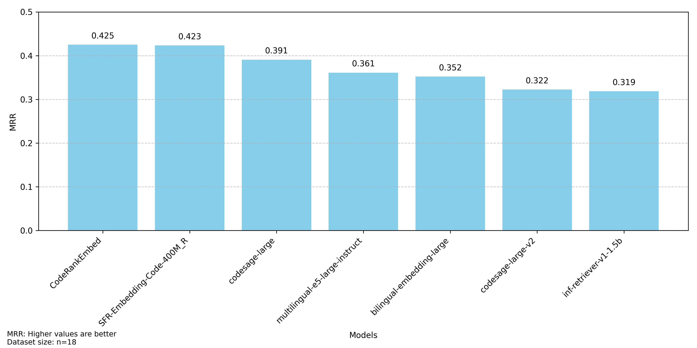

# Codeaware RAG

> [!Note]
> Currently, this project is in progress and not all sections are complete.

This projects aims to explore different retrieval and chunking approaches for questions about code.
For this purpose, we developed this RAG Evaluation System that can be extended with different retrievers and chunking approaches.

## Table of Contents
<!-- TOC -->
* [Codeaware RAG](#codeaware-rag)
  * [Table of Contents](#table-of-contents)
  * [Installation](#installation)
    * [Install the project](#install-the-project)
    * [Login to HuggingFace](#login-to-huggingface)
  * [Usage](#usage)
    * [Run Experiments](#run-experiments)
    * [Create a Custom Pipeline](#create-a-custom-pipeline)
  * [Configuration](#configuration)
  * [Project Decisions](#project-decisions)
    * [Datasets](#datasets)
    * [Chunking](#chunking)
    * [Embedding Models](#embedding-models)
    * [Pipelines](#pipelines)
    * [Evaluation](#evaluation)
  * [Results](#results)
    * [Baseline Results](#baseline-results)
    * [Custom Chunking Results](#custom-chunking-results)
    * [Embedding Summary Chunking Results](#embedding-summary-chunking-results)
  * [Future Work](#future-work)
    * [Dataset](#dataset)
    * [Evaluation Metrics](#evaluation-metrics)
    * [Additional Pipelines](#additional-pipelines)
      * [Graph Pipeline](#graph-pipeline)
      * [Search Pipeline](#search-pipeline)
<!-- TOC -->


## Installation
This project requires python 3.11 or higher and pip.
To install the project, you can use the following command:

### Install the project
```bash
pip install requirements.txt
```

### Login to HuggingFace
To use the HuggingFace models, you need to login to your HuggingFace account.
```bash
huggingface-cli login
```

## Usage

### Run Experiments
To run the experiments you have to clone the Flask repository in the same directory as this repository (e.g. `~/dir/flask`, `~/dir/codeaware-rag`).

Then you can run the following command to run the experiments:
```bash
python src/pipelies/<pipeline_name>.py # e.g. python src/pipelines/embedding_pipeline.py
```

### Create a Custom Pipeline
To create a custom pipeline, you can create a new file in the `src/pipelines` directory.
Each pipeline has to inherit from the `BasePipeline` class.
If you want to use an Embedding Pipeline, you can inherit from the `EmbeddingPipeline` class.


## Configuration
All important configuration parameters are stored in the `config.yaml` file.
Especially the parameters for the embedding models and the parameters can be found in this file.
The chat section contains the parameters that are used when running the streamlit app and the model is used for the EmbeddingSummaryPipeline.
Currently, all models from the [sentence-transformers](https://www.sbert.net/) library are supported.


## Project Decisions
In this section, we will document the decisions made during the development of the project.

### Datasets
We decided to use a custom dataset based on the Flask repository, because no dataset is available that fits our needs.
The closet dataset is the [CodeSearchNet](https://huggingface.co/datasets/sentence-transformers/codesearchnet) dataset, with the task is to find a function for a given comment.
The dataset is not suitable for our needs, as there were no questions regarding important concepts like inheritance or usage of functions.


### Chunking
For the chunking of the python files, we decided to use the [RecursiveCharacterTextSplitter](https://python.langchain.com/docs/modules/data_connection/document_loaders/text_splitters/character_text_splitter) from LangChain as a baseline.
LangChain is a well-known library for building RAG systems and provides a simple interface to split text into smaller chunks.
Besides the RecursiveCharacterTextSplitter, we also implemented a custom splitter.
See [Custom Splitter](#results) for more information.
As we do not intend to further develop chunking approaches, we did not include the Chunker in our Pipelines.
For changing the chunking approach, you have to change the chunking approach in the `file_processor.py` file.


### Embedding Models
To compare the performance of the different retrievers and splitters, we will use different embedding models.
Our focus was to keep the implementation simple, while providing a variety of models to compare.
We therefore decided to use the [sentence-transformers](https://www.sbert.net/) library.
All other providers (e.g. OpenAIProvider) are at different stages of development and not yet ready.

> [!TIP]
> You can find a list of currently top-level embedding models on the [HuggingFace MTEB Leaderboard](https://huggingface.co/spaces/mteb/leaderboard).


### Pipelines
To enable a fast prototyping of different retrievers, we decided to use a pipeline-based approach.
With this architecture we can focus on the preparation of the data and their retrieval, while the rest of the code is already implemented.
This means that the loading and chunking of the data, the model handling and the evaluation, is already implemented and can be reused.
Popular approaches like the [EmbeddingPipeline](src/pipelines/embedding_pipeline.py) can be reused to create a custom pipeline, as demonstrated in the [EmbeddingSummaryPipeline](src/pipelines/embedding_summary_pipeline.py).


### Evaluation
For the evaluation of the retrievers, we will use the Mean Reciprocal Rank (MRR) metrics.
Where $Q$ is the set of questions and $\text{rank}_i$ is the rank of the first relevant code chunk for question \(i\).
$$
\text{MRR} = \frac{1}{|Q|} \sum_{i=1}^{|Q|} \frac{1}{\text{rank}_i}
$$

We consider a chunk as relevant if at least one of the lines in the chunk is part of the answer defined in the dataset.

A big weakness of the MRR metric is that it only considers the first relevant code chunk found.
This means that questions that require multiple code chunks to be solved are not evaluated correctly.
We therefore recommend to use the MRR metric in combination with other metrics, that need to be implemented.

## Results
The results of the experiments including the validation file are stored in the `data` directory.
The results can currently only give a rough overview of the performance of the different retrievers.
To get a full overview of the performance multiple new metrics have to be implemented. See the [Future Work](#future-work) section for more information.
Also be aware that the selection of the embedding models was on the small models (< 2 Billion Parameters) [HuggingFace MTEB Leaderboard](https://huggingface.co/spaces/mteb/leaderboard) on May 2025.
The models and capabilities of the models are changing rapidly, so the results may not be representative for the current state of research.

### Baseline Results
The baseline results are stored in the `data/baseline_results.csv` file.
It consists of the following of the Langchain [RecursiveCharacterTextSplitter](RecursiveCharacterTextSplitter) and the [EmbeddingPipeline](src/pipelines/embedding_pipeline.py).
The `RecursiveCharacterTextSplitter` splits the code into smaller chunks based on following class and function definition as well as empty lines until the desired chunk size of 900 characters is reached.




### Custom Chunking Results
The idea of the custom chunking is to use the more [tree-sitter](https://tree-sitter.github.io/tree-sitter/) to create more meaningful chunks.
Instead of defining a maximum chunk size, we create exactly one chunk for each function and method in the codebase.
This should lead to more meaningful embeddings, as the embeddings are created for a single functionality and not for multiple ones.


### Embedding Summary Chunking Results
The idea of the embedding summary chunking is to use a LLM to summarize each code chunk and use the summary as the embedding.
As most of the embedding models are trained on text or code, but not on text and code, this could lead to better results.
For chunking we use the [RecursiveCharacterTextSplitter](RecursiveCharacterTextSplitter), as the custom chunking did not lead to better results.


> [!IMPORTANT]
> The results differ from the results used in the presentation.
> Unfortunately, there was a bug resulting in the embedding of wrong summaries.
> This bug has been fixed and the results have been updated.

## Future Work

### Dataset
To get a more comprehensive evaluation, we need to create a larger dataset.
A possible approach is to use a LLM to generate questions for a given repository.
We could use the current datasets as a starting point to evaluate few-shot prompting to generate questions and answers.
If successful, this could lead to a dataset that covers multiple repositories or even the evaluation of custom repositories.

### Evaluation Metrics
To get a full overview of the performance of the different retrievers, we need to implement additional metrics.
While it is unclear which exact metrics are necessary, the following problems should be solved:
- Questions that require multiple code chunks to be solved should be evaluated correctly. Possible solutions are:
  - Retrieve code chunks until all relevant code chunks are found.
- The MRR metric does not take into account the total number of relevant code chunks. It is likely that a smaller number of chunks would lead to better results.
  -  
- Only the retrieval and chunking performance is evaluated. It is unclear how the performance of the generator is affected by the different retrievers and chunking approaches.
  - We could use [LLM-as-a-Judge](https://arxiv.org/abs/2306.05685) to evaluate the end-to-end performance of the RAG system.


### Additional Pipelines
With the [Basepipeline](src/pipelines/base_pipeline.py) as a strong foundation, we can create additional pipelines that focus on custom retrievers.


#### Graph Pipeline
The graph pipeline will use a graph database to store the code chunks and their relationships.
The following relationships are planned:
- Function/Method definitions and their usages
- Inheritance relationships between classes
- Function/Method calls and their usages

For retrieval the following steps could be used:
1. Use an embedding model to find an anchor chunk for the query.
2. Use the graph database to find all related code chunks based on the anchor chunk.

This idea is currently in the early stages and needs to be further developed.

#### Search Pipeline
The search pipeline will use a text search to find the relevant code chunks.
Possible search ideas are:
- Search for text in code chunks
- Find variable definitions
- Prioritize search results based on specific patterns (e.g. class or function definitions)

For retrieval the following steps could be used:
1. Use a LLM to filter out key search terms from the query.
2. Use TF-IDF and similarity measures to find relevant code chunks.
