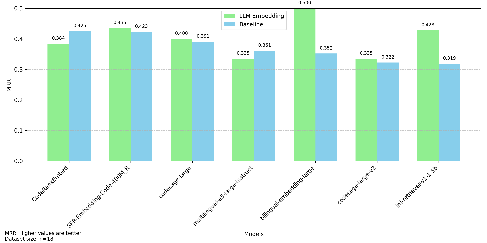

# Codeaware RAG

This project explores different retrieval and chunking approaches for code-related questions.
We developed a RAG Evaluation System that can be extended with various retrievers and chunking strategies.

## Table of Contents
<!-- TOC -->
* [Codeaware RAG](#codeaware-rag)
  * [Table of Contents](#table-of-contents)
  * [Installation](#installation)
    * [Requirements](#requirements)
    * [Install the project](#install-the-project)
    * [Login to HuggingFace](#login-to-huggingface)
  * [Usage](#usage)
    * [Run Experiments](#run-experiments)
    * [Create a Custom Pipeline](#create-a-custom-pipeline)
  * [Configuration](#configuration)
  * [Project Decisions](#project-decisions)
    * [Datasets](#datasets)
    * [Chunking](#chunking)
    * [Embedding Models](#embedding-models)
    * [Pipelines](#pipelines)
    * [Evaluation](#evaluation)
  * [Results](#results)
    * [Baseline Results](#baseline-results)
    * [Custom Chunking Results](#custom-chunking-results)
    * [Embedding Summary Chunking Results](#embedding-summary-chunking-results)
  * [Future Work](#future-work)
    * [Dataset](#dataset)
    * [Evaluation Metrics](#evaluation-metrics)
    * [Additional Pipelines](#additional-pipelines)
      * [Graph Pipeline](#graph-pipeline)
      * [Search Pipeline](#search-pipeline)
<!-- TOC -->

## Installation

### Requirements
- Python 3.11 or higher
- Pip

### Install the project
To install the project, run the following command:

```bash
pip install -r requirements.txt
```

### Login to HuggingFace
To use HuggingFace models, you need to authenticate with your HuggingFace account:
```bash
huggingface-cli login
```

## Usage

### Run Experiments
To run experiments, you must first clone the Flask repository in the same directory as this repository (e.g., `~/dir/flask`, `~/dir/codeaware-rag`).

Then run the following command to run the experiments:
```bash
python src/pipelines/<pipeline_name>.py # e.g. python src/pipelines/embedding_pipeline.py
```

### Create a Custom Pipeline
To create a custom pipeline, create a new file in the `src/pipelines` directory.
Each pipeline must inherit from the `BasePipeline` class.
For embedding-based pipelines, you can inherit from the `EmbeddingPipeline` class.

## Configuration
All important configuration parameters are stored in the `config.yaml` file, including parameters for embedding models and pipeline settings.
Currently, all models from the [sentence-transformers](https://www.sbert.net/) library are supported.

The chat section contains parameters used when running the Streamlit app via `streamlit run src/app.py`.
Additionally, the model is used for the EmbeddingSummaryPipeline.

## Project Decisions
This section documents the key decisions made during project development.

### Datasets
We developed a custom dataset based on the Flask repository because no existing dataset met our requirements.
The closest alternative is the [CodeSearchNet](https://huggingface.co/datasets/sentence-transformers/codesearchnet) dataset, which focuses on finding functions for given comments.
However, this dataset lacks coverage of important concepts like inheritance and function usage patterns.

### Chunking
For chunking Python files, we use the [RecursiveCharacterTextSplitter](https://python.langchain.com/docs/modules/data_connection/document_loaders/text_splitters/character_text_splitter) from LangChain as our baseline.
LangChain is a popular library for building RAG systems and provides a simple interface for splitting text into smaller chunks.

We also implemented a custom splitter (see [Custom Splitter](#results) for details).
Since we do not plan to further develop chunking approaches, we have not included the splitter in our pipelines.
To change the chunking approach, modify the splitter in the `file_processor.py` file.

### Embedding Models
To compare the performance of different retrievers and splitters, we use multiple embedding models.
Our focus was on maintaining implementation simplicity while providing a variety of models for comparison.
We therefore chose the [sentence-transformers](https://www.sbert.net/) library.
Other providers (e.g., OpenAIProvider) are at different stages of development and not yet ready for production use.

> [!TIP]
> You can find a list of current top-performing embedding models on the [HuggingFace MTEB Leaderboard](https://huggingface.co/spaces/mteb/leaderboard).

### Pipelines
To enable rapid prototyping of different retrievers, we adopted a pipeline-based approach.
This architecture allows us to focus on data preparation and retrieval while reusing existing implementations for data loading, chunking, model handling, and evaluation.

Popular approaches like the [EmbeddingPipeline](src/pipelines/embedding_pipeline.py) can be reused to create custom pipelines, as demonstrated in the [EmbeddingSummaryPipeline](src/pipelines/embedding_summary_pipeline.py).

### Evaluation
For retriever evaluation, we use the Mean Reciprocal Rank (MRR) metric, where $`Q`$ is the set of questions and $`\text{rank}_i`$ is the rank of the first relevant code chunk for question $`i`$.

```math
\text{MRR} = \frac{1}{|Q|} \sum_{i=1}^{|Q|} \frac{1}{\text{rank}_i}
```

We consider a chunk relevant if at least one of its lines is part of the desired code defined in the dataset.

A significant limitation of the MRR metric is that it only considers the first relevant code chunk found.
This means questions requiring multiple code chunks for complete answers are not evaluated correctly.
We recommend using the MRR metric in combination with other metrics that need to be implemented.

## Results
Experimental results, including validation files, are stored in the `data` directory.
The results currently provide only a rough overview of different retriever performance.
For a comprehensive performance assessment, multiple new metrics need to be implemented (see the [Future Work](#future-work) section).

Note that our embedding model selection was based on small models (< 2 billion parameters) from the [HuggingFace MTEB Leaderboard](https://huggingface.co/spaces/mteb/leaderboard) as of May 2025.
Since models and their capabilities evolve rapidly, these results may not represent the top models from this leaderboard.

### Baseline Results
Baseline results are stored in the `data/baseline_results.csv` file.
The baseline uses the LangChain [RecursiveCharacterTextSplitter](https://python.langchain.com/docs/modules/data_connection/document_loaders/text_splitters/character_text_splitter) and the [EmbeddingPipeline](src/pipelines/embedding_pipeline.py).
The `RecursiveCharacterTextSplitter` splits code into smaller chunks based on class and function definitions as well as empty lines until reaching the desired chunk size of 900 characters.


The baseline results show that code-specialized models (except `codesage-large-v2`) outperform models fine-tuned on English language.
Even the best-performing models achieve scores below 0.5, indicating significant room for improvement.

### Custom Chunking Results
The custom chunking approach was to use [tree-sitter](https://tree-sitter.github.io/tree-sitter/) to create more meaningful chunks.
Instead of defining a maximum chunk size, we create exactly one chunk for each function and method in the codebase.
This should lead to more meaningful embeddings, as embeddings are created for single functionalities rather than multiple ones.


We observe that the `CodeRankEmbed` and `inf-retriever-v1-1.5b` models are two significant outliers in this chart.
The reasons for this behavior are unclear, as we found no explanations in the respective model papers.
We suspect this is due to our small dataset size.
Our hypothesis that custom chunking leads to better embeddings is therefore not supported by these results.

### Embedding Summary Chunking Results
The embedding summary chunking approach uses an LLM to summarize each code chunk and uses the summary as the embedding.
Since most embedding models are trained on text or code separately and not both, this could potentially lead to better results.
For chunking, we use the `RecursiveCharacterTextSplitter`, as custom chunking did not yield better results.



We observe that results (except for `bilingual-embedding-large` and `inf-retriever-v1-1.5b`) are very similar to baseline results.
Both outliers are again unexplainable by the model papers.
Similar to custom chunking, we suspect the small dataset is responsible for these outliers.

> [!IMPORTANT]
> These results differ from those used in the presentation. Unfortunately, there was a bug that resulted in embedding incorrect summaries. This bug has been fixed and the results have been updated.

## Future Work

### Dataset
To achieve more comprehensive evaluation, we need to create a larger dataset.
A possible approach is using an LLM to generate questions for a given repository.
We could use current datasets as a starting point to evaluate few-shot prompting for generating questions and answers.
If successful, this could lead to a dataset covering multiple repositories or even enable evaluation of custom repositories.

### Evaluation Metrics
To obtain a complete overview of different retriever performance, we need to implement additional metrics.
While the exact metrics needed are unclear, the following problems should be addressed:

- Questions requiring multiple code chunks for complete solutions should be evaluated correctly. Possible solutions include:
  - Retrieving code chunks until all relevant chunks are found
- The MRR metric does not account for the total number of created code chunks. A smaller number of total chunks would likely lead to better results. Therefore, the number total chunks has to be part of at least one evaluation metric
- Only retrieval and chunking performance is evaluated. It is unclear how generator performance is affected by different retrievers and chunking approaches
  - We could use [LLM-as-a-Judge](https://arxiv.org/abs/2306.05685) to evaluate end-to-end RAG system performance

### Additional Pipelines
With the [BasePipeline](src/pipelines/base_pipeline.py) as a strong foundation, we can create additional pipelines that focus on custom retrievers.

#### Graph Pipeline
The graph pipeline will use a graph database to store code chunks and their relationships.
The following relationships are partially implemented or planned:
- Function/method definitions and their usages
- Inheritance relationships between classes
- Function/method calls and their usages

For retrieval, the following steps could be used:
1. Use an embedding model to find an anchor chunk for the query
2. Use the graph database to find all related code chunks based on the anchor chunk

This idea is currently in early stages and needs further development.

#### Search Pipeline
The search pipeline will use text search to find relevant code chunks. Possible search approaches include:

- Search for text in code chunks
- Find variable definitions
- Prioritize search results based on specific patterns (e.g., class or function definitions)

For retrieval, the following steps could be used:
1. Use an LLM to extract key search terms from the query
2. Use TF-IDF and similarity measures to find relevant code chunks